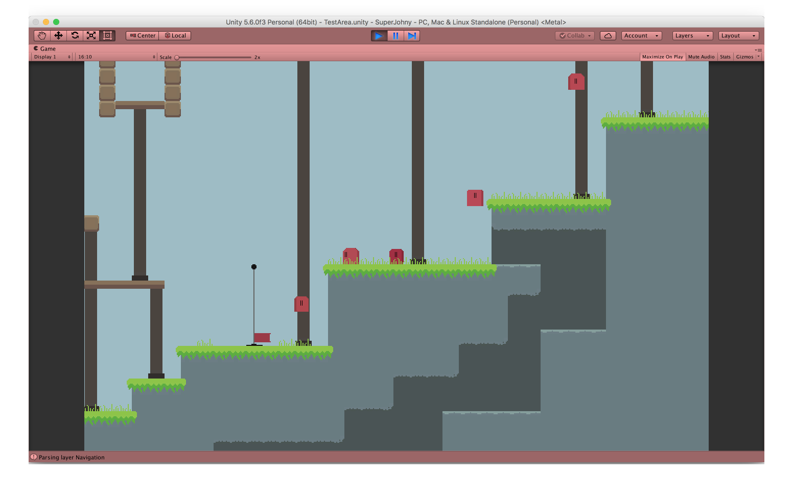
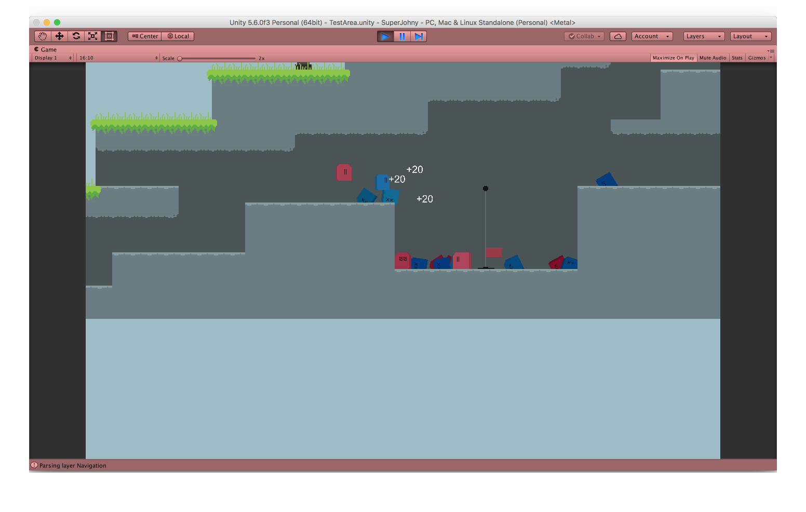
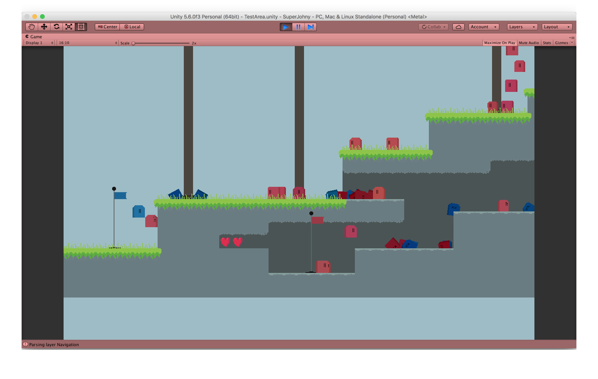

# Super Johny Resurrected

## About

This is my small Unity game. It's a Super Mario-styled platformer. There are 2 teams
of mobs that battle for the control of several flags in the level. The flags can be
captured and respawn mobs. Each team has a limited number of respawns and loses if
they lose the control of all flags or they lose all respawn points. Inspired by
Battlefield 2142.

## Unity

The game is made in Unity. It is currently using version `5.6.1f1`.

## Wiki

The [wiki on Github](https://github.com/chuckeles/super-johny-resurrected/wiki) contains
useful information about the game. There's the design docs and also simple technical
documentation. The point is to help me remember when I get back to the game.

## Screenshots

