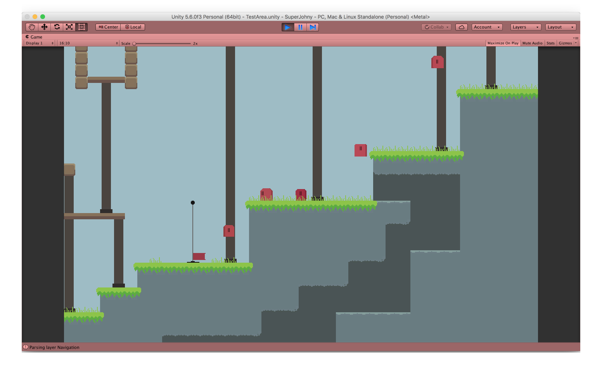
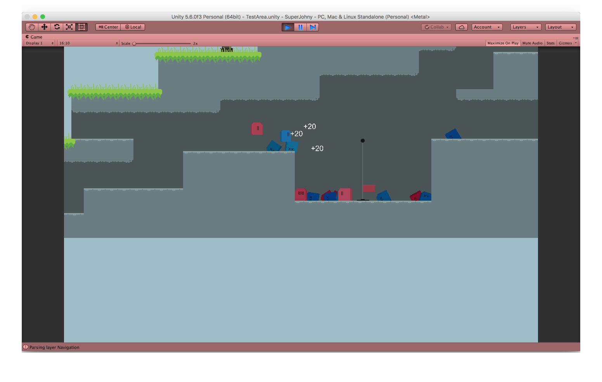
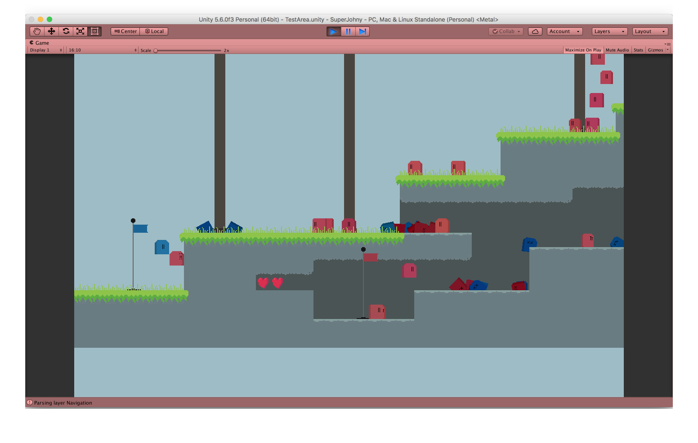

# Super Johny Resurrected

This is my small Unity game. It's a Super Mario-styled platformer. There are 2 teams of mobs that battle for the control of several flags in the level. The flags can be captured and respawn mobs. Each team has a limited number of respawns and loses if they lose the control of all flags or they lose all respawn points. Inspired by Battlefield 2142.

